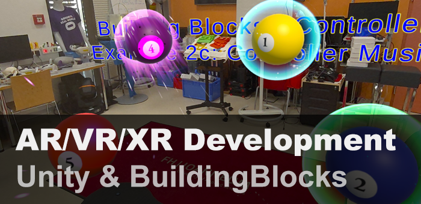
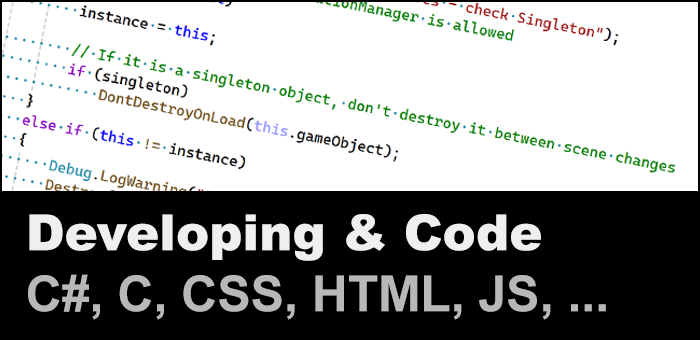
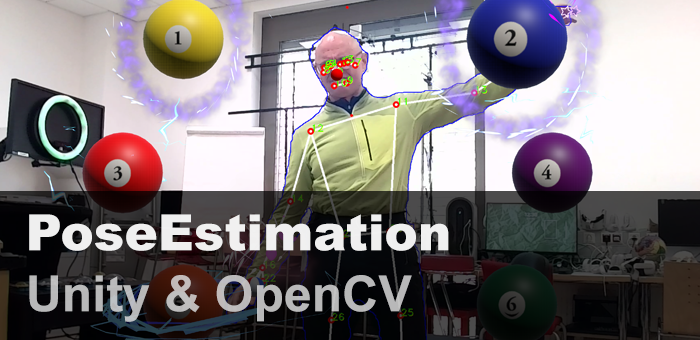
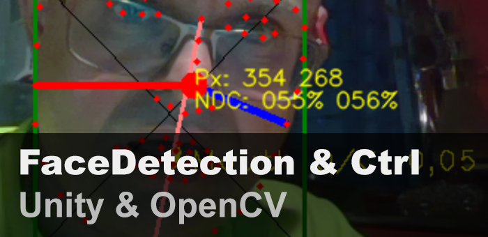
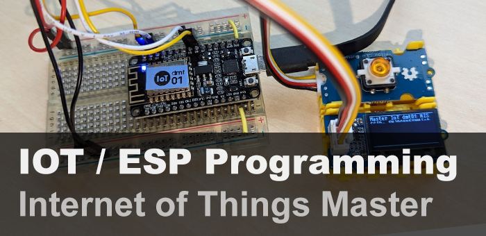
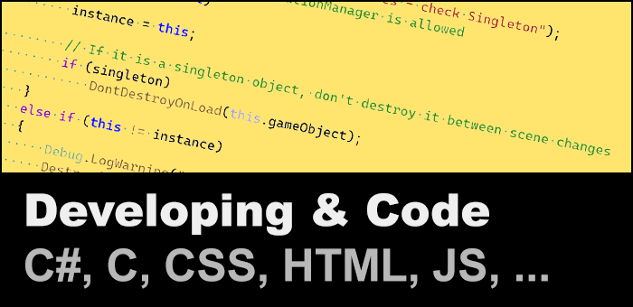
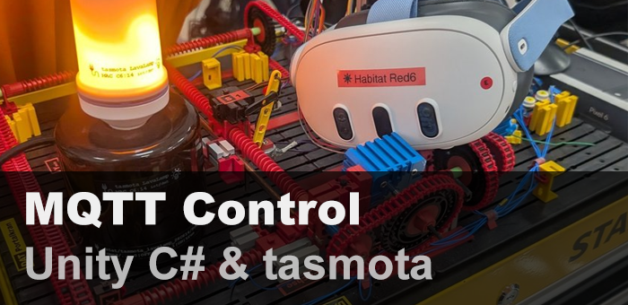
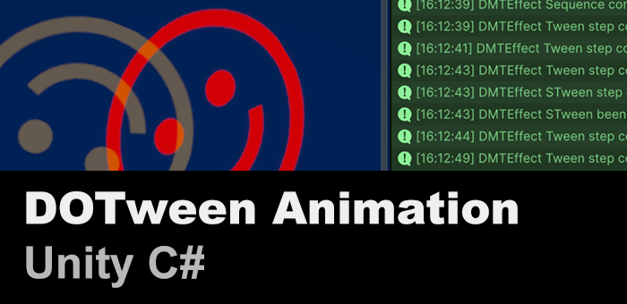
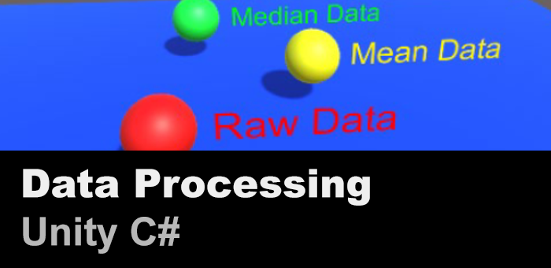

# Overview Git-Page for alle Repositories

> [!IMPORTANT]  
> This is the overview Page to all other Repositories

# Quick Link Page

## Mixed Reality

<table width=100%>
        <tr>
            <th> <a href="https://github.com/nischelwitzer/MixedReality_DevUnity">MR/XR Development</a></th>
            <th> <a href="../../..">home</a></th>
            <th> <a href="../../..">home</a></th>
        </tr>
        <tr>
            <td>Zeile 1, Spalte 1</td>
            <td>Zeile 1, Spalte 2</td>
            <td>Zeile 1, Spalte 3</td>
        </tr>
        <tr>
            <td>Zeile 2, Spalte 1</td>
            <td>Zeile 2, Spalte 2</td>
            <td>Zeile 2, Spalte 3</td>
        </tr>
        <tr>
            <td colspan="3">Zeile 3, verbundene Zelle</td>
        </tr>
</table>

|  [ ](../../../MixedReality_DevUnity) [MR/XR Development](https://github.com/nischelwitzer/MixedReality_DevUnity) |  [ ](../../..) [home](../../..) |  [ ](../../..) [home](../../..) |
|:---:|:---:|:---:|

## Open ComputerVision

|  [OpenCV PoseEstimation](../../../OCV-BodyPose-Tools) |  [BoundingBox](../../../OCV-face68-2DOF-Rotation) |  [Face Rotation](../../../OCV-face68-2DOF-Rotation) |
|:---:|:---:|:---:|
|  [FaceDetection Mask](../../../OCV-face68-FaceMask) |  [home](../../..)  |  [home](../../..)  |

## IOT and Electronics

|  [IOT Development](https://github.com/nischelwitzer/IOT-Master) |  [NeoPixel Multiboard](../../../Grove-NeoPixel-Multiboard) |  [MQTT Unity](../../../MQTT2Unity)  |
|:---:|:---:|:---:|

## Unity Goodies

|  [DOTween Animation](../../../DoTweenShow) |  [Mean Median](../../../Calc_MeanMedian) |  [Clock Button](../../../ClockButton) |
|:---:| :---:| :---:|
|  [C# Shot](../../../Cannon_MoveShot ) |  [C# Billboards](../../../Billboard_Modes) |   [C# ALotOf Objecs](../../../MultiObjects_XYZ) |  [home](../../..)  |  [home](../../..)  |

## some more 

|  [HTML](../../../HTML-CSS-Lecture-Basics) |  [home](../../..)  |  [home](../../..)  |
|:---:|:---:|:---:|

## About...

* 📫 Contact: nischelwitzer@gmail.com 
* 👥 Work: [FH JOANNEUM, Business Informatics](https://www.fh-joanneum.at/hochschule/person/alexander-nischelwitzer/)
* 🙌 Main Focus: Unity Development, Electronics, Usability
* 🎬 YouTube: [Channel](https://www.youtube.com/@AlexanderKNischelwitzer)
