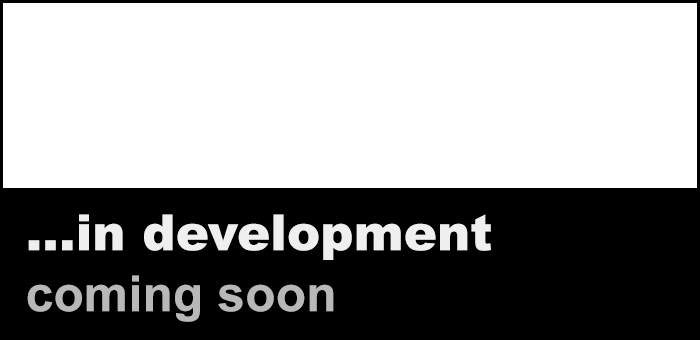

# Overview Git-Page to some of my Repositories 

> [!IMPORTANT]  
> This is my structured overview Page to <a href="https://github.com/nischelwitzer?tab=repositories">my Repositories</a> 

# Quick Link Page

<table width=100%>
        <tr>
            <th colspan="3"> Unity Ball Lecture Tools  </th>
        </tr>        
        <tr>
            <th width=33%><a href="../../../Rube_Goldberg_Machine"> Rube Goldberg Machine</a></th>
            <th width=33%><a href="../../../Ball_Game"> Ball Game</a></th>
            <th width=33%><a href="../../../Unity_Helper_Tools"> Unity_Helper Tools</a></th>
        </tr> 
        <tr>
            <th colspan="3"> Mixed Reality Development, Unity and Meta Quest3/3S  </th>
        </tr>        
        <tr>
            <th width=33%><a href="https://github.com/nischelwitzer/MixedReality_DevUnity">
               MR/XR Development</a></th>
            <th width=33%><a href="../../../mrLogger"> MR 3D Debug.Log</a> & MQTT</th>
            <th width=33%><a href="../../../mrSpawn2label"> MRUK Spawner@Label</a></th>
        </tr>
        <tr>
            <th width=33%><a href="../../../MRUK_Helper_Zero"> MRUK Scene Zero</a></th>
            <th width=33%><a href="../../../mrSpawn2label"> MRUK Spawn@Label</a></th>
            <th width=33%><a href="../../../mixed_reality_player"> MR Playing</a></th>
        </tr>        
        <tr>
            <th colspan="3"> OpenCV - Computer Vision with Unity and C#  </th>
        </tr>          
        <tr>
            <th width=33%><a href="https://github.com/nischelwitzer/OCV-BodyPose-Tools">
                     PoseEstimation</a></th>
            <th width=33%><a href="../../.."> -</a></th>
            <th width=33%><a href="../../.."> -</a></th>
        </tr>
        <tr>
            <th width=33%><a href="../../../OCV-face68-Nose-Mouth-BB"> Face NDC Nose</a></th>            
            <th width=33%><a href="../../../OCV-face68-FaceMask"> FaceDetection BoundingBox</a></th>
            <th width=33%><a href="../../../OCV-face68-2DOF-Rotation"> Face Rotation</a></th>
        </tr>       
        <tr>
            <th colspan="3"> Unity Goodies and Tools  </th>
        </tr>
        <tr>
            <th width=33%><a href="../../../DoTweenShow"> DoTween Animation</a></th>
            <th width=33%><a href="../../../Calc_MeanMediand"> Mean Median</a></th>
            <th width=33%><a href="../../../ClockButton"> Clock Button</a></th>
        </tr>
        <tr>
            <th width=33%><a href="../../../Billboard_Modes"> Billboard Image</a></th>
            <th width=33%><a href="../../../Cannon_MoveShot"> Shooting</a></th>
            <th width=33%><a href="../../../MultiObjects_XYZ"> A lot of Objects</a></th>
        </tr>
        <tr>
            <th width=33%><a href="../../../Unity-CSharp-Code-Snippets"> Code Snippet Collection</a></th>
            <th width=33%><a href="../../../applicationmanager"> Application Manager & more</a></th>
            <th width=33%><a href="../../../Unity_CSharp_Tools"> C# Tools & Tipps</a></th>
        </tr>
        <tr>
            <th colspan="3"> IoT and Electronics, Arduino, ESP, etc.  </th>
        </tr>            
        <tr>
            <th width=33%><a href="../../../IOT-Master"> IOT Master</a></th>
            <th width=33%><a href="../../../Grove-NeoPixel-Multiboard"> NeoPixel MultiBoard</a></th>
            <th width=33%><a href="../../../Templates_Arduino"> Arduino Templates</a></th>
        </tr>      
        <tr>
            <th colspan="3"> HTML und Web  </th>
        </tr>
        <tr>
            <th width=33%><a href="../../../HTML-CSS-Lecture-Basics"> HTML und CSS</a></th>
            <th width=33%><a href="../../.."> -</a></th>
            <th width=33%><a href="../../.."> -</a></th>
        </tr>
</table>

## About me...

* 📫 Contact: nischelwitzer@gmail.com 
* 👥 Work: [FH JOANNEUM, Business Informatics](https://www.fh-joanneum.at/hochschule/person/alexander-nischelwitzer/)
* 📍 FH JOANNEUM, ES30i.1S.R104 or online, Graz, Austria, EU
* 🙌 Main Focus: Unity Development, Electronics, Usability, Multimedia, Mixed Reality
* 🎬 [YouTube Channel](https://www.youtube.com/@AlexanderKNischelwitzer) with Tutorials
* 👾 take a look at my <a href="http://www.nischelwitzer.com" target="_blank">private Homepage</a>
* 👉 visit also <a href="https://www.thingiverse.com/nischi" target="_blank">Thingiverse 3D Printing</a> Projects
* 📅 last update: 2025

